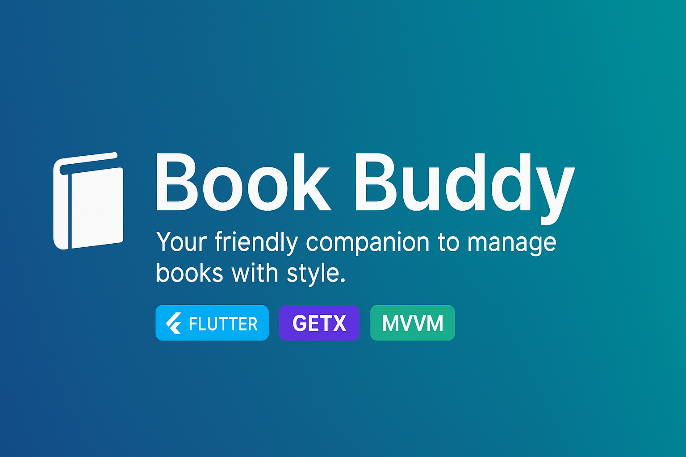

<p align="center">
  
</p>

<h1 align="center">📚 Book Buddy</h1>

<p align="center">
  <i>Your friendly companion to view & favorite books with style.</i><br>
  <b>Built with Flutter • GetX • MVVM Architecture</b>
</p>

<p align="center">
  
  
  
</p>

## 🚀 Features

- 🔐 **User Authentication** (Login/Register)
- 👤 **User Profile Management**
- 📚 **View & Search Books**
- ❤️ **Favorites Section**
- 🌐 **Network Connectivity Handling**
- 🧠 **Built with MVVM using GetX Controller**
- 📱 **Responsive UI for Android & iOS**

## 🎥 Demo

Here’s a walkthrough video of the **Book Buddy** app in action:

<iframe src="https://drive.google.com/file/d/1DqGEeAzYlyV9Y_5xRMpKF-t0B44fbkPf/preview" width="640" height="360" allow="autoplay"></iframe>  
<!-- Replace the link above with your actual demo video URL -->

## 🧱 Architecture 

Book Buddy follows the **MVVM** (Model-View-ViewModel) architecture pattern using **GetX** for state management and routing.

```
lib/ 
├── models/ # Data models 
├── resources/ # Routes and constants 
├── utils/ # Utilities (snackbars, validators, etc.) 
├── view_models/ # GetX ViewModels (controllers) 
├── views/ # UI Screens 
└── main.dart # App entry point
```

## 🛠️ Tech Stack

- **Flutter** – UI toolkit
- **Dart** – Language for logic and data
- **GetX** – State management, routing, and DI
- **Shared Preferences** – Local persistent user data
- **MVVM Architecture** – Clean code separation

## 🧪 Getting Started

To run this app locally:

```bash
# Clone the repo
git clone https://github.com/your-username/book_buddy.git
cd book_buddy

# Install dependencies
flutter pub get

# Run on device or emulator
flutter run
📌 Ensure you have Flutter SDK 3.22+ installed.

```

## 💡 What I Learned

* ✅ Implemented MVVM architecture using GetX effectively

* 🔁 Managed state and navigation using GetX

* 🎨 Built responsive and clean UIs with Flutter

* 💾 Used SharedPreferences for login persistence

* 🧪 Developed and tested a complete Flutter app from scratch


## 🙌 Author  
**Ashhad Ahmed**

- 🔗 [Connect on LinkedIn](https://www.linkedin.com/in/ashhad-ahmed-7a4a35259/)  
- 📧 Email: [ashhadahmed72@gmail.com](mailto:ashhadahmed72@gmail.com)
